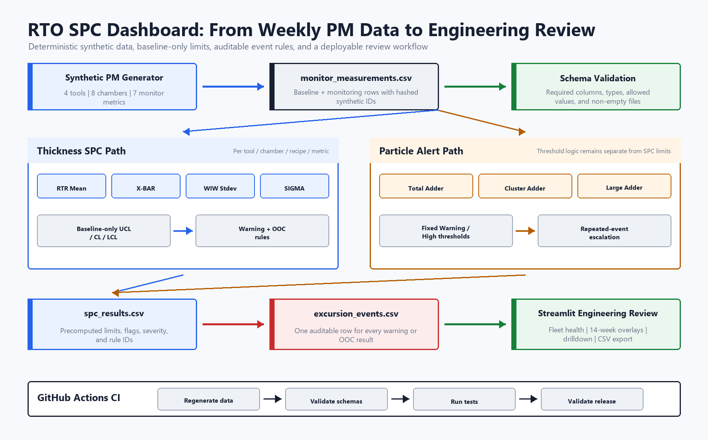
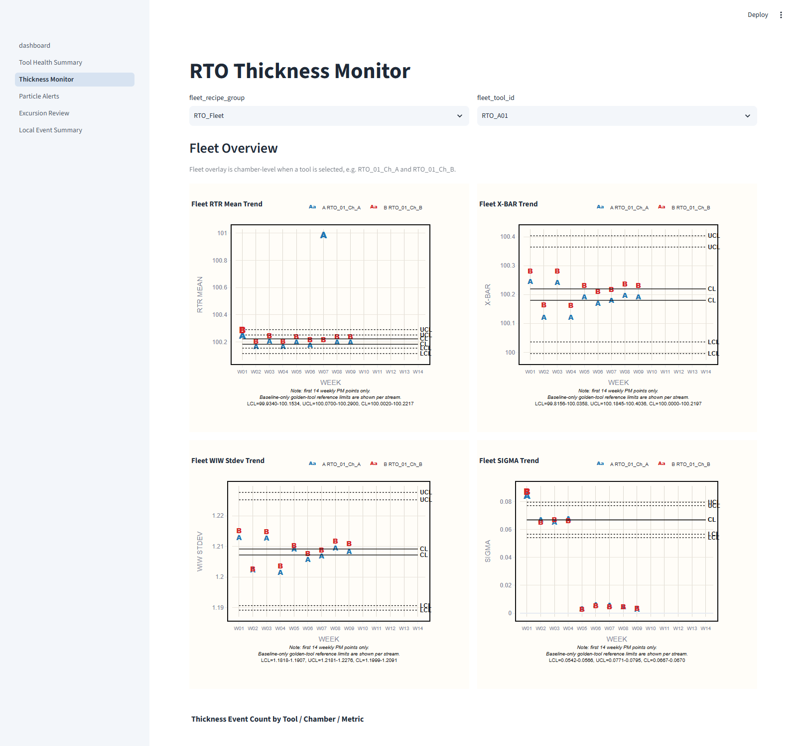
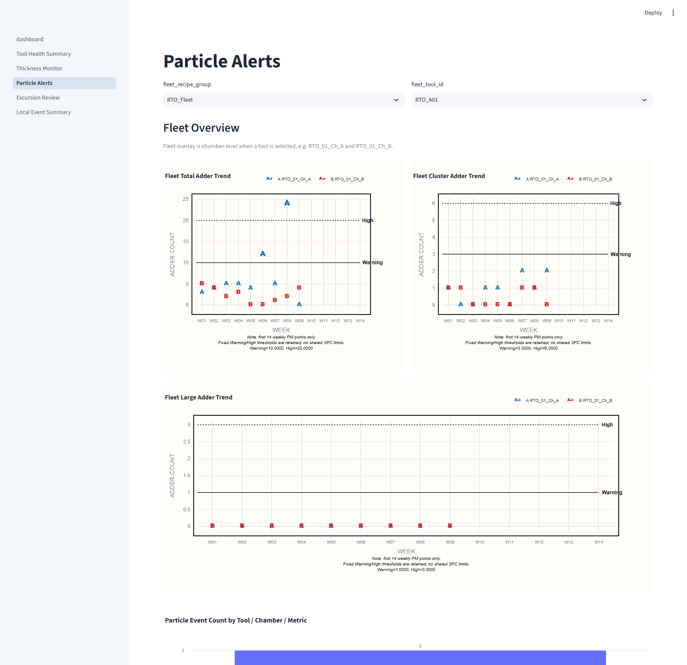
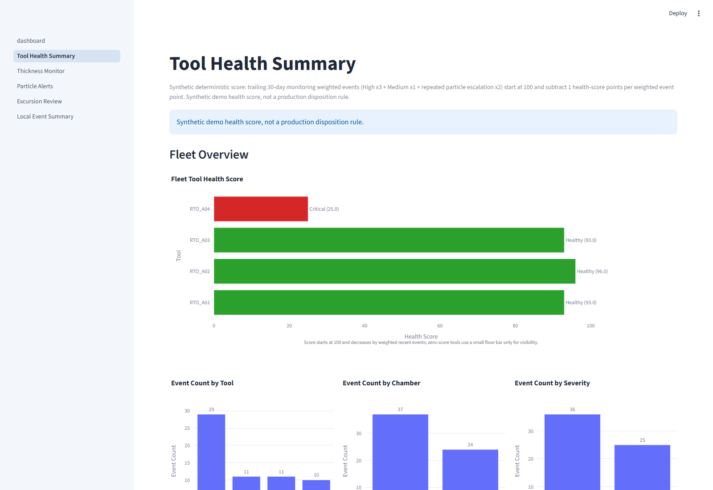
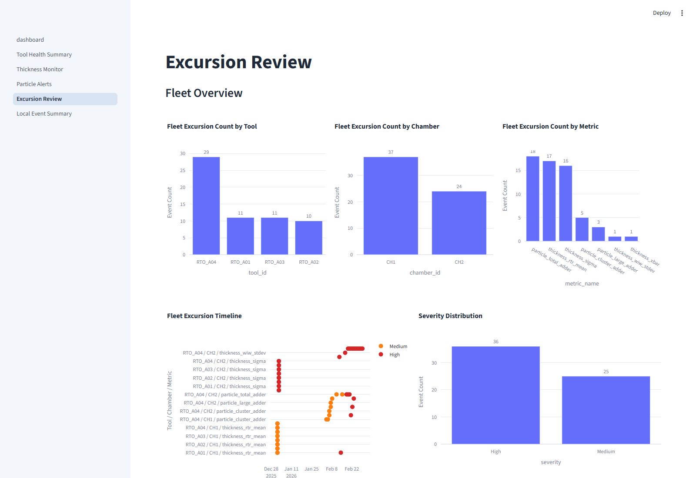

# RTO SPC Dashboard

An RTO-focused semiconductor equipment monitoring portfolio project built with Python, Streamlit, Plotly, and deterministic SPC rules.

This is an RTO-only synthetic dashboard.


## Project Flow



## SPC Review Charts

### RTO Thickness Fleet Overlay

RTR Mean, X-BAR, WIW Stdev, and SIGMA overlay chamber A/B points against one baseline-only Golden Tool LCL/CL/UCL reference set per chart.



### Particle Fleet Overlay

Total, Cluster, and Large Adder charts retain fixed Warning/High thresholds and repeated-event escalation.



## Review Workflow

| Fleet health prioritization | Excursion review and traceability |
| --- | --- |
|  |  |

## Capability Map

| Capability | Evidence |
| --- | --- |
| Semiconductor SPC | RTO thickness and particle rules, chamber-level review, baseline integrity, and separate stream limits |
| Python and data engineering | Deterministic generation, validated CSV contracts, modular rule engines, and persisted event records |
| Product and delivery | Streamlit drilldown, Plotly review charts, automated tests, GitHub Actions, and deployment documentation |

<details>
<summary><strong>Methodology and scope guardrails</strong></summary>

Thickness Phase 1 uses RTR Mean, X-BAR, WIW Stdev, and SIGMA.

Particle Phase 1 uses Total Adder, Cluster Adder, and Large Adder threshold + repeated-event alerts.

Limits are calculated from baseline data only.

Fleet charts are visualization-only and do not calculate shared SPC limits.

All alerts are persisted to excursion_events.csv.

### Thickness

- `thickness_rtr_mean`
- `thickness_xbar`
- `thickness_wiw_stdev`
- `thickness_sigma`

Mean metrics flag warning-zone and beyond-control-limit events. Variation metrics use one-sided high variation alerts. Every UCL, CL, and LCL comes from baseline rows for the same tool/chamber/recipe/metric stream.

### Particle

| Metric | Warning | High |
| --- | ---: | ---: |
| `particle_total_adder` | 10 | 20 |
| `particle_cluster_adder` | 3 | 6 |
| `particle_large_adder` | 1 | 3 |

Particle logic preserves Warning/High thresholds and repeated-event escalation; it does not substitute shared SPC limits.

</details>

<details>
<summary><strong>Run, test, and deploy</strong></summary>

```bash
python -m pip install -r requirements-dev.txt
python scripts/generate_sample_data.py
python scripts/validate_data.py
pytest
python scripts/validate_release.py
streamlit run app/dashboard.py
```

Open `http://127.0.0.1:8501/` on the same machine.

Streamlit Community Cloud settings:

| Setting | Value |
| --- | --- |
| Main file | `app/dashboard.py` |
| Python | 3.11+ |
| Secrets | None |

See [deployment_guide.md](docs/deployment_guide.md) for the deployment checklist.

</details>

<details>
<summary><strong>Repository map</strong></summary>

```text
app/                 Streamlit entry point and review pages
src/rto_spc/         Data generation, limits, rules, scoring, and charts
data/                Public-safe synthetic CSV outputs
tests/               Unit, integration, schema, release, and QA gates
scripts/             Data generation, validation, and visual regeneration commands
docs/                Methodology, architecture, deployment, and reviewer guidance
.github/workflows/   GitHub Actions CI
```

</details>

## Public-Safety Statement

This project uses fully synthetic and anonymized semiconductor monitor data for public portfolio demonstration only. It does not contain real tool identifiers, real recipe names, real product information, real wafer records, real lot records, real process limits, real SPC limits, or any confidential manufacturing information.

This project is an engineering review aid. It does not determine root cause, make production disposition decisions, or represent a production SPC system.
