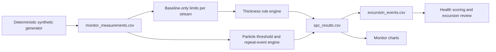

# Architecture Overview

The pipeline is intentionally small:

- `data_generator.py` creates synthetic RTO monitor measurements.
- `control_limits.py` calculates baseline-only per-stream limits for thickness rows without monitoring-data leakage.
- `thickness_monitor_rules.py` applies Phase 1 thickness rules.
- `particle_rules.py` applies threshold and repeated-event particle rules.
- `excursion_scoring.py` persists every warning/OOC row as an event.
- `chart_helpers.py` renders fleet and selected-stream visualizations from precomputed results.

Thickness and particle rules are independent branches. The dashboard does not recalculate limits or OOC status in the UI.
